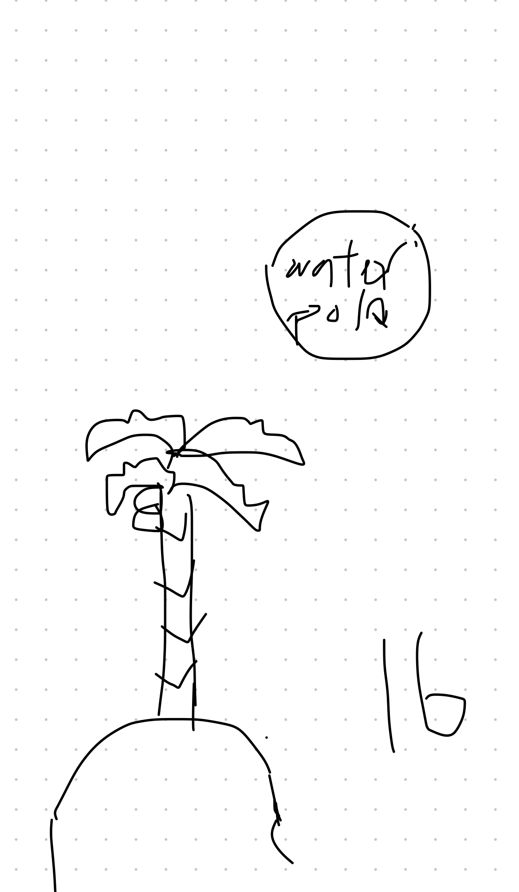
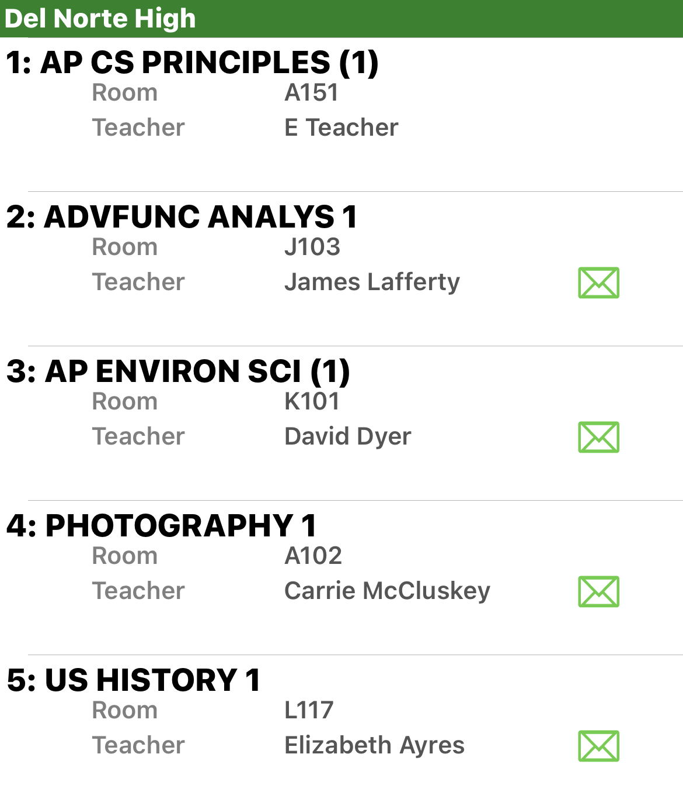

## Chris's Blog.

Hi! I'm Chris. I'm a Junior and I'm on the Water Polo team

my github:

What I look like:

My freeform!

Lastly, this is my class schedule:

## Notes on the hacks:

# Week 0:
- Go to _config.yml to change the blog theme.
- Index.md should be used for changing blog content
- Google Markdown Cheatsheet or W3Schools HTML Tutorial for guidance.

# Calculator:
- /_posts/<date>Example-calculator.md has code for the calculator project
- The calculator is simple for the theme and a good starting point

# Game:
- A more advanced calculator in a way with data storage and many other skills.

# Tools and equipment:
- Need computer
- Draw freeform
- Add self to the user database

# Installation hacks:
- I am using WSL for my type of shell commands
- Annotate what we learn(notes)
- Keep track of file locations
- Keep updating things.
- Running on local host and viewing github pages is different because local host only allows you to view your website or blog from your device. On the other hand, on GitHub, you can view a website from anywhere you want.
- How do you change the domain name?

# Grades:
- Must ask questions
- No paper
- Late work defended during office hours
- High “A” is an exceeding the requirements grade.
- A low “A” is meeting the requirements and expectations.
- “B” has flaws and mistakes.
- "C" lacks effort and tangibles.
- Low “C” is missing school, disrupting class, and doing “inappropriate things”
Zero is plagiarism.

Week 1:
# Python IO:
- From the Python directory run quiz.py in VS Code, this will show the workflow of Input and Output in the terminal
- Build Jupiter notebook
- xBuild a quiz that includes original questions and shows outputs
- Create both markdowns for description and code for execution
- Add comments to Python code
Additional requirements:
- Build your quiz so that it captures the critical Vocabulary from this Jupyter document
- Calculate the percentage of your quiz
- Review the College Board Big Idea outline, and see if you can reference locations in Markdown that support vocabulary
Extra credit:
- Do you see a repeating pattern of code? Try to implement a solution to avoid the repeating pattern (hint: list and iteration)

# JavaScript input:
- Making calculator

# Linux Shell and Bash:
- Come up with the process of how tools are installed.
- Add blog notes.
- What do we use to verify tool installation?
- To update a repository we use ctrl+s and then run the make command in the terminal

# Github pages anatomy:
Index.md is the file with markdowns
- _includes/nave_home.html is the submenu

# Style:
- /assets/css/style.css has the import of style customization.

## Overview of Hacks, Study and Tangibles
Blogging in GitHub pages is a way to learn and code at the same time.

- Plans, Lists, [Scrum Boards](https://clickup.com/blog/scrum-board/) help you to track key events, show progress and record time.  Effort is a big part of your class grade.  Show plans and time spent!
- [Hacks(Todo)](https://levelup.gitconnected.com/six-ultimate-daily-hacks-for-every-programmer-60f5f10feae) enable you to stay in focus with key requirements of the class.  Each Hack will produce Tangibles.
- Tangibles or [Tangible Artifacts](https://en.wikipedia.org/wiki/Artifact_(software_development)) are things you accumulate as a learner and coder.